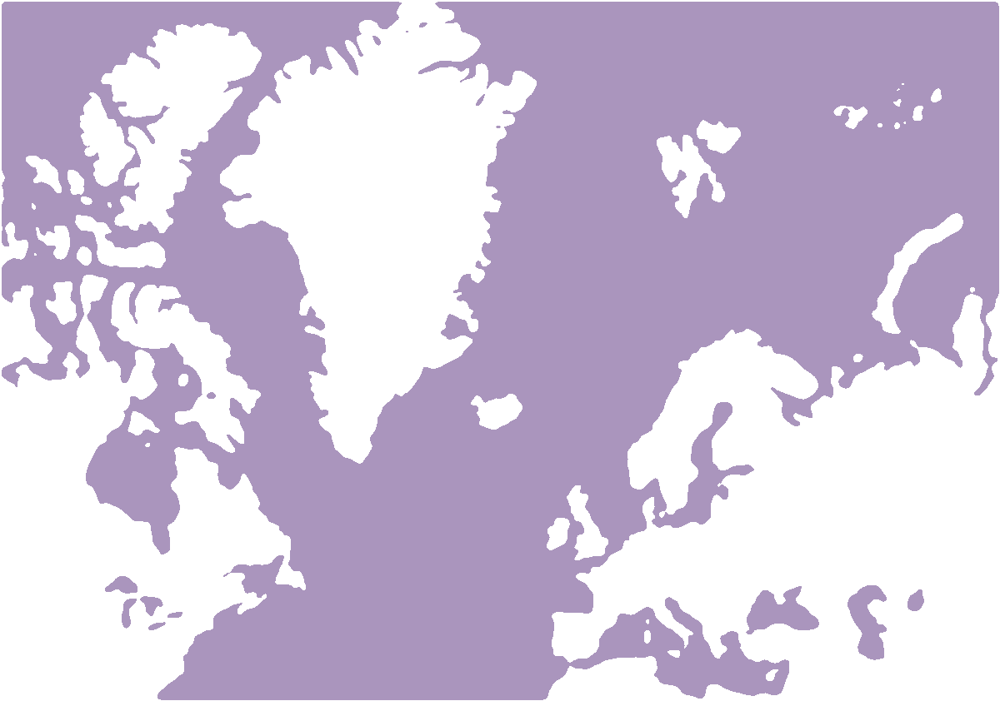

## Chapters 

1. [Prologue - Snow Globe](./0/)
2. [Sunday - EMPART](./1/)
3. [Monday - Red & Green](./2/)
4. [Tuesday - tv off](./3/)
5. [Wednesday - Flowers](./4/)
6. [Thursday - Terminus](./5/)

## Digital Formats

<a href="./epub/The_Monterey_Protocols.epub" target="_blank">epub</a>  |  <a href="./assets/monterey-protocols_A5.pdf" target="_blank">pdf</a>  | <a href="./assets/monterey-protocols-zine.pdf" target="_blank">DIY zine</a>  

## Physical Copies

<a href="https://www.lulu.com/shop/2qx/the-monterey-protocols/paperback/product-84dydww.html" target="_blank">paperback</a> | <a href="https://www.lulu.com/shop/2qx/the-monterey-protocols/hardcover/product-84dj4qp.html" target="_blank">hardcover</a> | 
<a href="https://www.lulu.com/shop/2qx/the-monterey-protocols-large-print/hardcover/product-gj44zk6.html" target="_blank">large print</a>  | [free zine](zine.md)

## Offline

This site may work offline.

    

[about](./about.md) | [donate](./donate.md) | [licence](LICENCE)